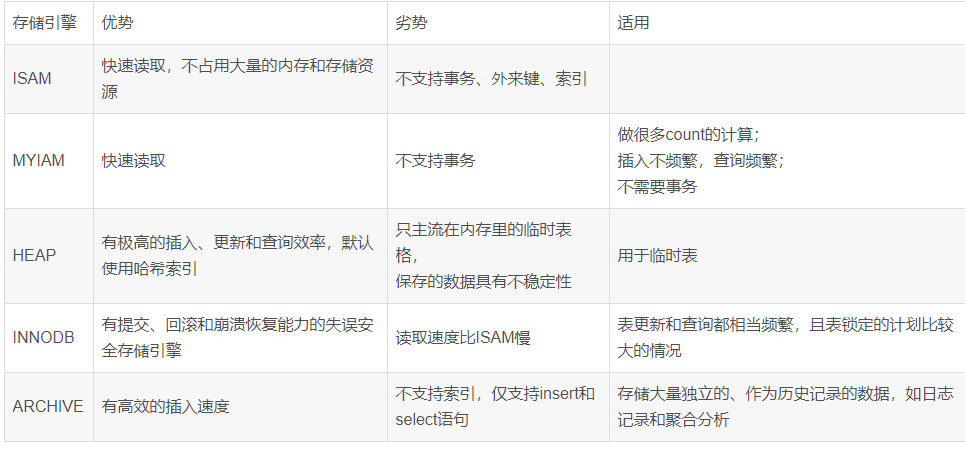

##1.重点，mysql的存储引擎
- 重点看下
- 重点看下

- 详解myabtis缓存使用
  - https://baijiahao.baidu.com/s?id=1748282345119959927&wfr=spider&for=pc
  - https://cloud.tencent.com/developer/article/2297085

一级缓存没发关闭！只能设置为STATEMENT，查询时清空缓存

一级就是一个sqlsession级别的map存储

二级式namespace级别的存储

mybatis游标
- https://blog.csdn.net/isea533/article/details/129772055
- https://blog.csdn.net/weixin_42740540/article/details/129047465?utm_medium=distribute.pc_relevant.none-task-blog-2~default~baidujs_baidulandingword~default-0-129047465-blog-129772055.235^v39^pc_relevant_yljh&spm=1001.2101.3001.4242.1&utm_relevant_index=3

mybatis分页

mybatis日志
